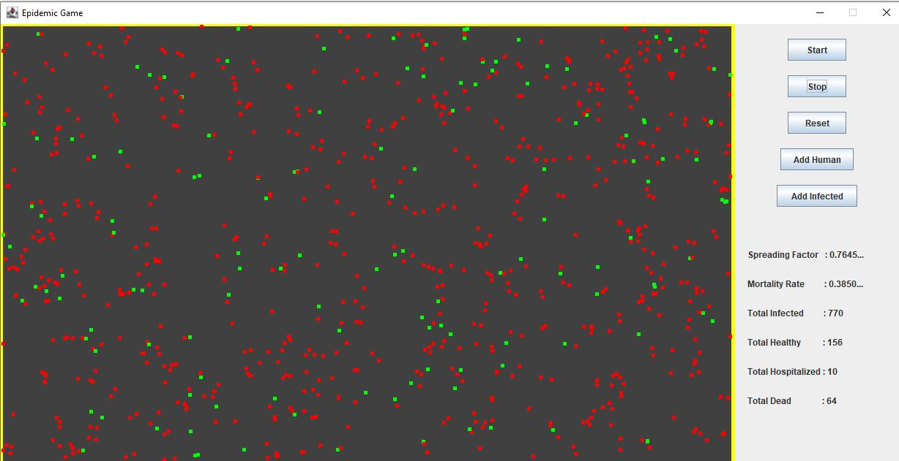

# Epidemic-Simulation-Program

## Project Features

* The project was developed using the Model-View-Controller design architecture.
* GUI is multi-threaded, always responsive.
* Used producer/consumer paradigm to implement the hospital functionality.
* Used Mediator design pattern for model and implement the interaction between individuals to Strive for maintenance cost reduction and flexibility. 
* Swing library is used for GUI design.
* Used Prototype design pattern for creating individuals. 

## Simulation Rules

* Each individual represent by 5x5 square in 1000x600 canvas.
* Randomly 1 individual assigned infected at the beginning.
* Let two individuals I_1 and I_2 collide, with mask statuses M_1 and M_2, and social distances D_1 and D_2 respectively. Let I_1 be infected and I_2 be healthy. They stay together for a duration C=max{C_1,C_2} before parting, and the social distance between them is D=min{D_1,D_2}.
* According to p=min(R * (1+C/10) * M_1 * M_2 * (1-D/10),1) formula, if p>0.5, this individual will assume infected.
* After 25 seconds, individual hospitilazed and deleted from canvas temporarily.
* After 10 seconds, hospitilazed individual back to canvas as healty.
* Hospital has individual count / 10 ventilator. If hospital full, individual back to canvas and when 1 ventilator be empty go to hospital.
* An infected individual will die after 100 * (1-Z) seconds if he/she still infected.

## Example of Simulation

## USAGE
* You can run this program from executable jar file by this command _"java -jar MVCEpidemic.jar"_, (jar file has been compiled by version of the Java Runtime (class file version 59.0)) 
* If you use older jre, you can compile the program _“javac *.java”_ command and run this program _“java Main”_ command.

**_For detailed description please read report.pdf file._**

